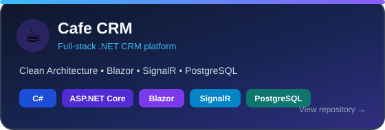
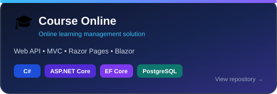
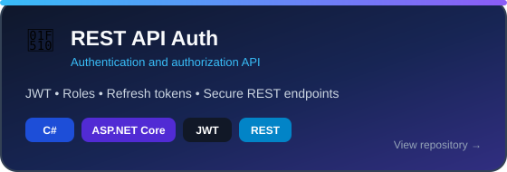
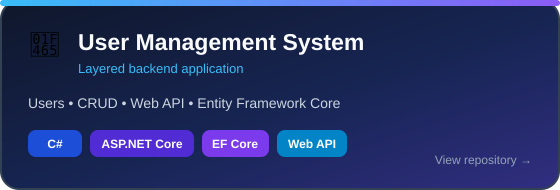

<a name="top"></a>

<div align="center">


<br>

<a href="https://github.com/jumaevshahrom07"></a>
<a href="https://t.me/shom_07"></a>
<a href="mailto:shahromdzumaev61@gmail.com"></a>


</div>

---

## 👨‍💻 About Me

```csharp
public sealed class Developer
{
    public string Name     => "Shahrom Jumaev";
    public string Role     => ".NET Backend Developer";
    public string Location => "Dushanbe, Tajikistan 🇹🇯";

    public string[] Stack =>
    [
        "C#", "ASP.NET Core", "EF Core",
        "PostgreSQL", "JWT", "SignalR"
    ];

    public string[] Learning =>
        ["Docker", "Microservices", "Testing"];

    public string Status => "Open to opportunities";
}
```

- 🔭 Разрабатываю REST API на **ASP.NET Core** с **Clean Architecture** и **CQRS**
- 🗄️ Работаю с **PostgreSQL**, **Entity Framework Core**, миграциями и связями
- 🔐 Реализую **JWT authentication**, refresh-токены и роли
- ⚡ Использую **SignalR** и интеграции с внешними API
- 🌱 Изучаю **Docker**, микросервисы и автоматическое тестирование

---

## 🧰 Tech Stack

<div align="center">


<br><br>


</div>

---

## 🚀 Featured Projects

<div align="center">

<a href="https://github.com/jumaevshahrom07/Cafe-CRM">
  
</a>
<a href="https://github.com/jumaevshahrom07/Course-Online">
  
</a>

<br>

<a href="https://github.com/jumaevshahrom07/rest-api-auth">
  
</a>
<a href="https://github.com/jumaevshahrom07/user-management-system">
  
</a>

</div>

> Карточки проектов хранятся прямо в этом репозитории, поэтому они не зависят от временно недоступных внешних сервисов.

---

## 📊 GitHub Analytics

<div align="center">


</div>

---

## 🐍 Contribution Snake

<div align="center">

<picture>
  <source media="(prefers-color-scheme: dark)" srcset="https://raw.githubusercontent.com/jumaevshahrom07/jumaevshahrom07/output/github-contribution-grid-snake-dark.svg" />
  <source media="(prefers-color-scheme: light)" srcset="https://raw.githubusercontent.com/jumaevshahrom07/jumaevshahrom07/output/github-contribution-grid-snake.svg" />
  
</picture>

</div>

---

## 📫 Let's Connect

<div align="center">

Открыт к стажировкам и вакансиям **Junior / Middle .NET Backend Developer**

<br><br>

<a href="https://t.me/shom_07"></a>
<a href="mailto:shahromdzumaev61@gmail.com"></a>
<a href="https://github.com/jumaevshahrom07"></a>

<br><br>

> **Build. Learn. Improve. Repeat.**


</div>